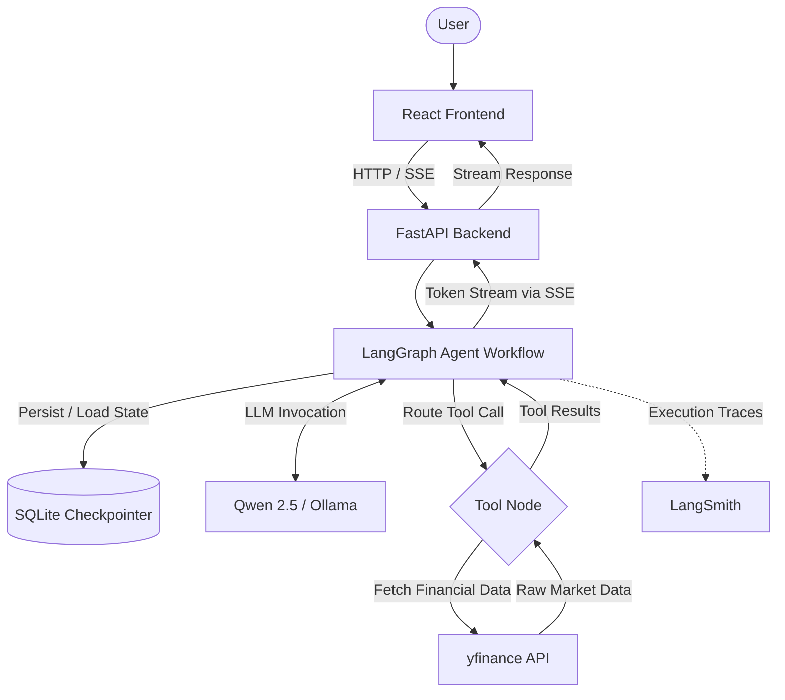

# StockInsight

Agentic financial research assistant powered by LangGraph, Qwen 2.5, FastAPI, and yfinance.

StockInsight is an AI application for natural-language stock research. Users can ask questions about stock prices, company profiles, financial metrics, historical performance, and stock screening, while the LangGraph agent dynamically selects the appropriate research tools, queries live market data, and synthesizes structured insights.

---

## Key Features

- **Agentic Tool Selection**: Dynamically routes user queries to specialized financial research tools using LangGraph state machines.
- **Natural-Language Stock Research**: Queries fundamentals, financial metrics, and price history in plain English.
- **Financial Research Tools**: Integrates with `yfinance` to pull live stock prices, company profiles, financial statements, and OHLC data.
- **Stock Screening**: Runs predefined market screens such as day gainers, technology growth, and undervalued stocks.
- **Streaming Responses**: Delivers real-time token streaming to the frontend using FastAPI Server-Sent Events (SSE).
- **Persistent Sessions**: Manages multi-turn conversation state across distinct sessions using SQLite checkpointing.
- **FastAPI Backend**: Asynchronous API server handling agent execution, streaming, and session history management.
- **LangSmith Observability**: End-to-end execution tracing for agent decision-making and tool invocations.

---

## How It Works



---

## Agent Tools

The LLM is equipped with five tools for retrieving stock and market data:

| Tool | Purpose |
| --- | --- |
| `simple_screener` | Stock screening using predefined market screens |
| `get_stock_price` | Latest available price and daily change |
| `get_company_profile` | Company and business information |
| `get_financial_summary` | Key financial and valuation metrics |
| `get_stock_history` | Historical OHLC and volume data |

LangChain exposes these tools to the LLM via tool binding, while LangGraph manages conditional routing and tool execution within the agent loop.

---

## Streaming & Persistence

- **Streaming**: FastAPI exposes a `POST /chat/stream` endpoint that streams model output tokens using Server-Sent Events (SSE). Raw internal tool output is processed and filtered on the backend before final response tokens are streamed to the frontend.
- **Persistence**: LangGraph state is checkpointed in SQLite via `SqliteSaver`. Each chat session is tracked using a unique `thread_id`, enabling multi-turn conversation memory and session switching without state loss.

---

## Tech Stack

- **AI & Agent Engine**: Python, LangGraph, LangChain, Qwen 2.5 (14B), Ollama
- **Backend API**: FastAPI, Uvicorn, Server-Sent Events (SSE)
- **Financial Data**: `yfinance` (Yahoo Finance API)
- **Persistence**: SQLite, `SqliteSaver`
- **Frontend**: React 19, Vite, Tailwind CSS v4
- **Observability**: LangSmith

---

## Project Structure

```
stockScreener/
├── backend_flow.py       # LangGraph agent graph, state, and nodes
├── fastapi_backend.py    # FastAPI server, REST endpoints, and SSE streaming
├── tool.py               # yfinance tool definitions (@tool functions)
├── requirements.txt      # Python backend dependencies
└── frontend/             # React + Vite frontend application
    ├── src/
    │   ├── components/   # UI components (Sidebar, ChatInput, MessageBubble)
    │   ├── services/     # API client and SSE stream reader (api.js)
    │   └── App.jsx       # Main application layout and state logic
    ├── package.json      # Frontend package configuration and scripts
    └── vite.config.js    # Vite configuration
```

---

## Run Locally

### 1. Prerequisites
- Python 3.10+
- Node.js 18+ and npm
- Ollama installed and running

### 2. Start Ollama Model
Pull and run the Qwen 2.5 model:
```bash
ollama pull qwen2.5:14b
```

### 3. Configure Environment (Optional)
Create a `.env` file in the project root to enable LangSmith tracing:
```env
LANGCHAIN_TRACING_V2=true
LANGCHAIN_API_KEY=your_langsmith_api_key
LANGCHAIN_PROJECT=StockInsight
```

### 4. Launch Backend Server
Install dependencies and run the FastAPI server:
```bash
pip install -r requirements.txt
python fastapi_backend.py
```
The backend will be available at `http://localhost:8000`.

### 5. Launch Frontend
In a separate terminal, navigate to the frontend directory and start the dev server:
```bash
cd frontend
npm install
npm run dev
```
Open `http://localhost:5173` in your browser.

---

## Disclaimer

StockInsight is intended for educational and informational research purposes and does not provide personalized financial advice.
