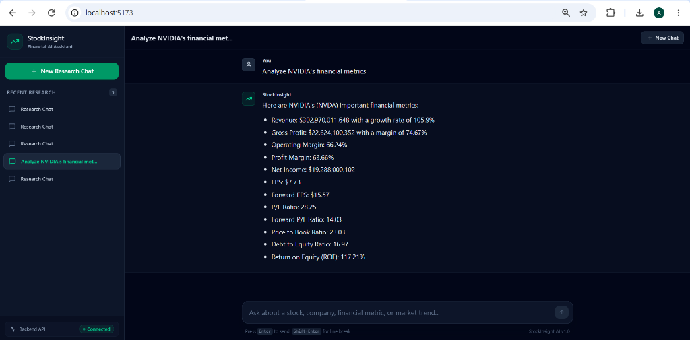
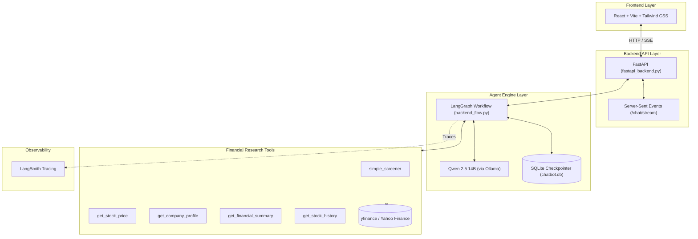

# StockInsight

**AI-powered stock research and screening agent built with LangGraph, Qwen 2.5, FastAPI, and modern web technologies.**

StockInsight is an agentic financial assistant that replaces manual ticker hunting with natural-language conversations. Users can ask about stock prices, company profiles, financial metrics, historical performance, stock screeners, or side-by-side company comparisons. 

Rather than relying on rigid keyword routing, StockInsight uses an LLM-driven agentic graph to dynamically decide which financial tools to invoke, execute them against live data providers, and synthesize raw metrics into clean, structured insights.



---

## ⚡ Key Features

- **Natural-Language Stock Research**: Conversationally query market data, earnings metrics, and price trends.
- **Agentic Tool Calling**: The agent autonomously determines which tools are required to answer complex multi-part queries.
- **Stock Screening**: Filter top market gainers, losers, technology stocks, and valuation candidates.
- **Fundamental & Technical Data**: Pull real-time prices, financial statements, valuation ratios (P/E, ROE, margins), and OHLC history.
- **Real-Time Streaming**: Stream model output token-by-token using Server-Sent Events (SSE).
- **Persistent State Checkpointing**: State and conversation history persisted per `thread_id` via SQLite.
- **Decoupled Architecture**: High-performance FastAPI backend paired with a modern React + Vite frontend.
- **Observability**: Full agent execution tracing and tool monitoring integrated with LangSmith.

---

## 🧠 How the Agent Works

StockInsight executes a cyclic decision loop powered by **LangGraph** and **Qwen 2.5 (14B)**:

```
[User Query] ──▶ [LLM Agent Node] ──▶ Requires Tool? ──┬─ Yes ──▶ [Tool Execution Node] ──▶ (Feed results back to LLM)
                                                      │
                                                      └─ No  ──▶ [Stream Final Response]
```

1. **Evaluation**: The LLM evaluates user intent and inspects available tool definitions.
2. **Tool Execution**: If data is needed, the graph routes execution to the specified financial research tool.
3. **Synthesis**: Tool outputs (raw financial JSON/dictionaries) are passed back into the graph state for the LLM to format and present.

---

## 🏗️ Architecture & Data Flow



---

## 🛠️ Financial Research Tools

The agent is bound to five specialized tools exposed via LangChain function calling:

| Tool | Description |
|---|---|
| `simple_screener` | Screens stocks using predefined Yahoo Finance market filters (day gainers, tech growth, etc.). |
| `get_stock_price` | Fetches the latest market price, currency, and daily percentage movement for a ticker. |
| `get_company_profile` | Retrieves business summary, sector, industry, market cap, and employee count. |
| `get_financial_summary` | Pulls fundamental metrics including Revenue, EPS, Profit Margins, P/E ratio, Debt-to-Equity, and ROE. |
| `get_stock_history` | Downloads historical OHLC (Open, High, Low, Close) and volume data across custom timeframes. |

---

## 🌊 Streaming & Real-Time Responses

StockInsight streams response tokens incrementally for a responsive chat experience:

1. LangGraph streams messages in chunked tokens during graph execution.
2. FastAPI exposes `POST /chat/stream` returning `text/event-stream`.
3. Server-Sent Events (SSE) forward formatted JSON data payloads (`data: {"type": "token", "content": "..."}`).
4. The React frontend parses incoming stream chunks line-by-line via `ReadableStream` and renders Markdown progressively.

---

## 💾 State Persistence

State checkpointing is powered by LangGraph's `SqliteSaver` connected to `chatbot.db`:

- Every research interaction is isolated under a unique `thread_id`.
- Interrupted or multi-turn research workflows preserve context across sessions.
- Users can seamlessly switch between active and historical research threads without losing agent memory.

---

## 🧰 Tech Stack

| Component | Technology |
|---|---|
| **AI & Agent** | LangGraph, LangChain, Qwen 2.5 (14B), Ollama |
| **Backend API** | Python, FastAPI, Uvicorn, SSE |
| **Data Provider** | yfinance (Yahoo Finance API) |
| **Persistence** | SQLite, LangGraph `SqliteSaver` |
| **Frontend** | React 19, Vite, Tailwind CSS v4, Lucide React, React Markdown |
| **Observability** | LangSmith |

---

## 🔌 API Endpoints

FastAPI exposes the following core endpoints (`fastapi_backend.py`):

- `POST /chat/stream` — Main streaming endpoint consuming a prompt and `thread_id`, returning an SSE text stream.
- `POST /chat` — Synchronous chat endpoint returning complete assistant response object.
- `GET /conversations` — Retrieves list of existing persistent thread IDs from SQLite checkpoints.
- `GET /conversations/{thread_id}` — Loads full message history for a given conversation thread.
- `POST /conversations` — Instantiates a new thread ID session.
- `GET /health` — Returns service status and health information.

---

## 📂 Project Structure

```
stockScreener/
├── backend_flow.py       # LangGraph agent workflow & state machine definition
├── fastapi_backend.py    # FastAPI application, CORS, and SSE streaming endpoints
├── tool.py               # yfinance tool declarations (@tool wrappers)
├── chatbot.db            # SQLite checkpoint database
├── frontend/             # React + Vite frontend application
│   ├── src/
│   │   ├── components/   # Sidebar, Header, ChatInput, MessageBubble, EmptyState
│   │   ├── services/     # API integration & SSE stream parser (api.js)
│   │   └── App.jsx       # Main application layout and state management
│   ├── package.json
│   └── vite.config.js
├── docs/assets/          # Project documentation screenshots
├── .env                  # Environment variables configuration
└── README.md             # Technical project documentation
```

---

## 🚀 Run Locally

### 1. Prerequisites
- **Python 3.10+**
- **Node.js v18+** & **npm**
- **Ollama** with Qwen 2.5 installed (`ollama pull qwen2.5:14b`)

### 2. Environment Configuration
Create a `.env` file in the project root:
```env
LANGCHAIN_TRACING_V2=true
LANGCHAIN_API_KEY=your_langsmith_api_key_here
LANGCHAIN_PROJECT=StockInsight
```

### 3. Start Local LLM
```bash
ollama run qwen2.5:14b
```

### 4. Launch FastAPI Backend
Install Python dependencies and start the API server:
```bash
pip install -r requirements.txt
python fastapi_backend.py
```
The API server will run at `http://localhost:8000`.

### 5. Launch React Frontend
In a separate terminal:
```bash
cd frontend
npm install
npm run dev
```
Open `http://localhost:5173` in your browser.

---

## 🎯 Engineering Highlights

- **Autonomous Tool Selection**: Leveraged LangGraph cyclic state graph to let LLM decide tool execution without rigid heuristic branching.
- **Production Streaming Protocol**: Engineered SSE streaming pipeline filtering raw internal tool JSON to emit only clean assistant markdown tokens.
- **Decoupled Architecture**: Clean separation between FastAPI backend state engine and React frontend UI.
- **Zero-Data Loss Persistence**: Integrated SQLite checkpointing guaranteeing long-running multi-turn session persistence.

---

## 🔮 Future Improvements

- PostgreSQL backing for enterprise-scale checkpoint storage.
- Interactive financial charting components (ApexCharts / Recharts).
- News sentiment analysis and SEC filing research tools.
- Automated evaluation suite for tool selection accuracy.

---

## ⚠️ Disclaimer

*StockInsight is built strictly for informational and educational purposes. Financial market data depends on upstream providers and does not constitute financial advice.*
